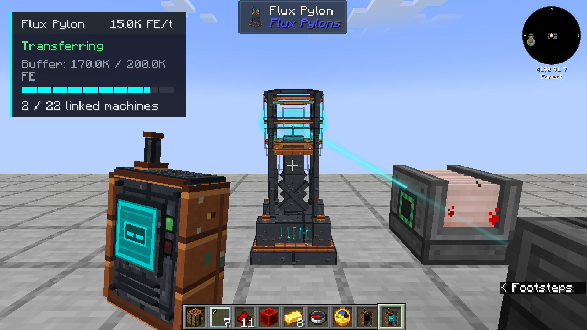

# Flux Pylons

Power nearby machines wirelessly, leaving their faces free for items, fluids and the rest of your setup. One pylon can supply several machines without a cable or receiver block attached to each one.

Feed a pylon from a generator or energy cell, link machines with the handheld Flux Gadget, and add more pylons to cover your base. Inspired by Draconic Evolution's wireless energy crystals and Tesla coils.

[Download](https://www.curseforge.com/minecraft/mc-mods/flux-pylons) · [Wiki](https://github.com/shikyo13/Flux-Pylons/tree/main/docs/wiki) · [Issues](https://github.com/shikyo13/Flux-Pylons/issues) · [Discord](https://discord.gg/NrdXnbWzGC) · [Showcase](https://youtu.be/Ngc5F5Z9F7c)



## Features

- Wireless delivery to linked machines with an enabled external FE input.
- Shared power between loaded pylons on the same network and dimension.
- Live storage, output, machine status and recent output history.
- Equal, round-robin and nearest-first delivery priorities.
- Range, connection, transfer and buffer upgrades.
- Redstone controls, network colors and adjustable beams and sound.
- Network ownership, member permissions and optional passwords.
- An animated guide in the gadget, included in 1.2.0.

## Getting started

1. Place a Flux Pylon and feed FE into it.
2. Hold a Flux Gadget and sneak-right-click in the air to switch it on.
3. Right-click the air to create or select a network.
4. Right-click the pylon to assign it to that network.
5. Sneak-right-click the pylon, then right-click nearby machines to link them.
6. Right-click the air to leave linking mode.

The [wiki](https://github.com/shikyo13/Flux-Pylons/tree/main/docs/wiki) covers status readings, multiplayer, upgrades and troubleshooting.

## Compatibility

The current build targets Minecraft **1.20.1**, **Forge 47.4.10 or later in the 47 series**, and **Java 17**. Install it on both the server and clients. An FE source from another mod is needed; Flux Pylons does not generate power or keep chunks loaded.

Use the file's version and loader tags when downloading. See the [roadmap](ROADMAP.md) for planned ports.

## Build

Use JDK 17 and the included Gradle wrapper:

```sh
./gradlew assemble
```

The JAR is written to `build/libs/`. This branch contains the 1.20.1 Forge port; the download page identifies released files.

For the full build and asset verification, install Python 3.13.3, `requirements-assets.txt`, and FFmpeg 8.0.1 with libvorbis. The [build workflow](.github/workflows/build.yml) pins the Linux FFmpeg build used for byte-identical audio:

```sh
python3 -m venv .venv
.venv/bin/python -m pip install -r requirements-assets.txt
./gradlew build -PpythonExecutable=.venv/bin/python
./gradlew runGameTestServer
```

## Contributing and license

Bug reports, translations and contributions are welcome. Read [CONTRIBUTING.md](CONTRIBUTING.md) and the [Flux Pylons license](LICENSE).

You may play, research, contribute, redistribute unmodified official releases and include them in modpacks without asking. Retain the license and credit. Separately released modified builds, ports and feature variants require permission.

Support ZeroTheAbsolute through [Buy Me a Coffee](https://buymeacoffee.com/zerotheabsolute) or [Patreon](https://www.patreon.com/cw/ZeroTheAbsolute/membership).

